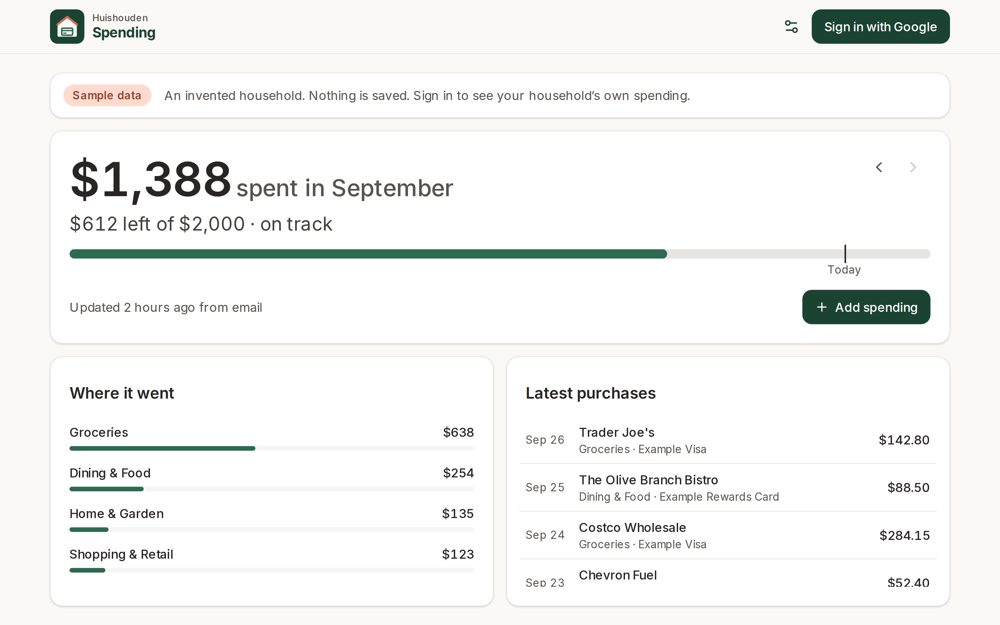
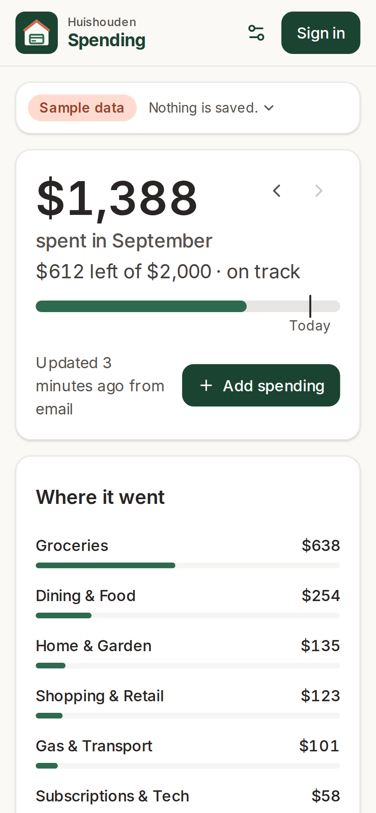
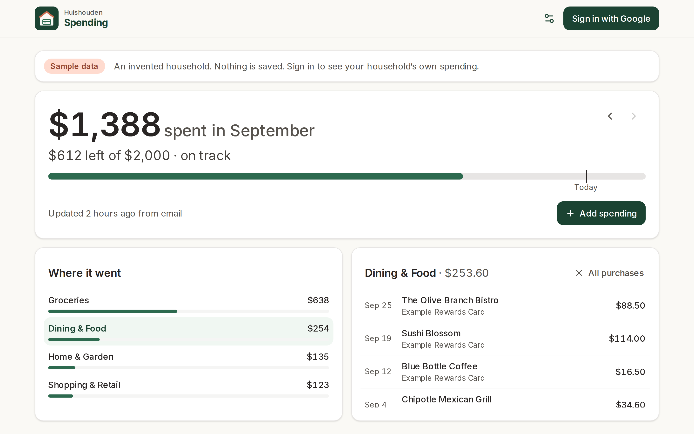
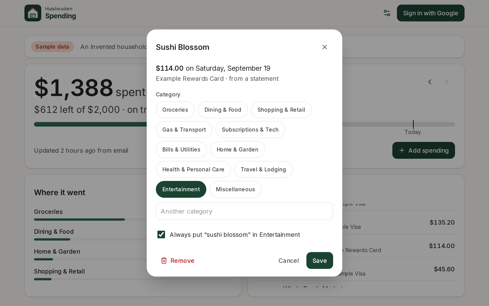
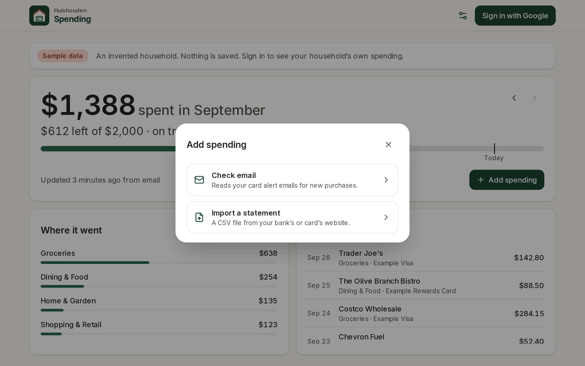
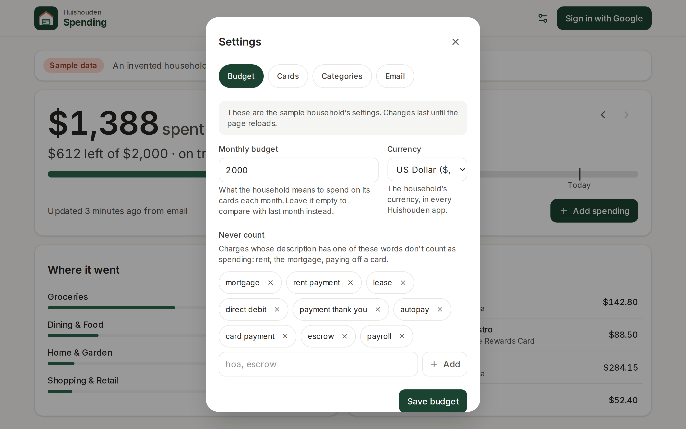

# Huishouden Spending

Where the household's money goes. Open it and the first thing you see answers "how are we doing
this month?": what has been spent, what is left of the budget and whether that is on track, readable
from across the room on the kitchen tablet. Below it, where the money went and the latest
purchases; tap one to put it in another category. Live at https://huishouden-piekstra.web.app/spending/, also
linked from the [Huishouden portal](https://huishouden-piekstra.web.app). The old address,
huishouden-spending.web.app, redirects there.

| This month | On a phone |
|---|---|
|  |  |

| One category | A purchase |
|---|---|
|  |  |

| Add spending | Settings |
|---|---|
|  |  |

_Screenshots of the live site with its built-in sample household (invented cards and amounts),
refreshed by CI after each deploy._

## How a household uses it

Anyone can sign in with Google, start a household on the Huishouden home screen, and use Spending
without anything set up for them. Everything happens in the browser, as the member, with their
household's data in Firestore under `households/{id}/`:

| What | How | Stored in |
|---|---|---|
| Cards: name, last 4 digits, bank, alert words | Settings > Cards | `spendingCards` |
| Category rules: "the shop's name contains X → category Y" | Settings > Categories; starts with a default set; "Always put <shop> in <category>" on any purchase | `spendingRules` |
| Budget (none: compared with last month), currency, words never counted (rent, card payments), Gmail labels | Settings > Budget, Settings > Email | `spendingSettings/main` |
| Statement files | Add spending > Import a statement: any bank's or card's CSV; columns and sign found from the file, remembered per card | `spendingTransactions` (`source: statement`) |
| Card purchase alert emails | Add spending > Check email: reads the member's own Gmail (read-only, asked for once in a popup; Google warns the app is unverified the first time), searching each card's alert words and the household's labels. Runs again on open while access is fresh (an hour); never opens a popup by itself | `spendingTransactions` (`source: alert`) |

Every import is categorised by the household's rules and de-duplicated against what is there: the
same card and amount within 3 days with a similar description is the same purchase (the Apps
Script's rule, plus the description check). A statement row replaces the email alert for the same
purchase, since the statement has the real date and the bank's name for the shop.

Signed out, the app shows an invented sample household with the same screens, kept in memory and on
its own clock (27 September 2026), so every screenshot shows the same month. Signed in to an account
that is in no household yet, it points to the Huishouden home screen to start one or be invited.

## Moving from the Sheet and its Apps Script (legacy)

Households that started with a Google Sheet and `apps-script/` can keep it running: the script
writes `spendingTransactions` with its owner's credentials, and the app shows those alongside
everything members add. To switch:

1. Open Spending signed in as a household member. Settings > Email > **Bring settings from a Google
   Sheet**: paste the Sheet's link and Read the Sheet (read-only access, asked once), or
   paste the rows of the Cards, Categories and Alert labels tabs. Bring them in: cards (with their
   Alert source as the bank and Alert keywords as alert words), category rules and labels.
2. Settings > Cards: add each card's alert sender address to its alert words (the script searched
   fixed senders; the app searches only what the household lists).
3. Check email once and compare with the script's rows; alerts the script already wrote are
   recognised and skipped.
4. Stop the script: in the Sheet, Extensions > Apps Script > Triggers, delete the
   `syncCardTransactionsFromGmail` trigger. Its documents stay; nothing is deleted.

The script (`apps-script/`, see its README) is kept for households that have not switched. New
households don't need it.

## Privacy

Household data lives in the household's own Firestore documents, visible only to its members.
To catch problems early, the app sends reports to New Relic (free tier) through
`@huishouden/pwa-kit/observability`: errors (emails, ids, query strings and long numbers removed),
Core Web Vitals and page loads, the app version, device type, and the country and region New Relic
derives from the request; and anonymous usage counts per visit: `check email` (and whether it was tapped or ran on open), `add spending`, `import statement`, and which view or settings tab is open. Households are counted by a
hash of the id. No names, emails, entries, free text or precise location, and no cookie or stored
id: nothing links one visit to the next. When the browser sends Global Privacy Control or Do Not
Track, usage counts are skipped; errors and speed still go. Local builds, staging and automated
browsers send nothing. The page people see is
[huishouden-piekstra.web.app/privacy](https://huishouden-piekstra.web.app/privacy); details in pwa-kit
[docs/observability.md](https://github.com/huishouden/pwa-kit/blob/main/docs/observability.md).

## Develop

```sh
bun install          # also enables the pre-commit leak scan
bun run dev          # http://localhost:3000
bun run lint && bun run test && bun run build
bun run e2e          # Playwright against the live site (BASE_URL to override): smoke tests and the
                     # sample household's flows, with Gmail answered by page.route
bun run script:push  # legacy: deploy apps-script/ to a Sheet (tests first); see apps-script/README.md
```

Security rules live in [huishouden/rules](https://github.com/huishouden/rules) `firestore.rules`
(one rules file per Firebase project); see `docs/firestore-rules-spending.md`.

Built on [pwa-kit](https://github.com/huishouden/pwa-kit) and follows its
[standard](https://github.com/huishouden/pwa-kit/blob/main/STANDARD.md). Merges to `main` deploy to
Firebase Hosting (project `huishouden-piekstra`), then run the e2e tests and refresh the screenshots.
